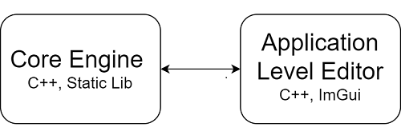
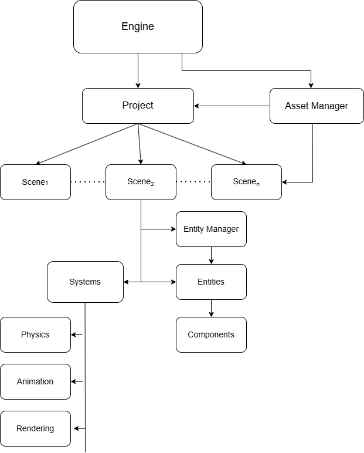

# Elysium — A Custom 2D Rendering and Simulation Engine (C++)

Elysium is a **custom-built 2D rendering and simulation engine** written in modern C++, developed as a long-term self-directed project focused on **real-time graphics, engine architecture, and interactive system design**.

The project currently targets an **end-to-end 2D workflow**, including rendering, physics simulation, scripting, and editor tooling. The broader long-term vision includes extending the architecture toward 3D and additional graphics APIs; however, the present implementation is intentionally scoped to **robust, well-structured 2D systems**.

---

## Project Focus

- Real-time **2D rendering pipelines**
- **Data-oriented ECS architecture**
- Physics simulation and collision detection
- Interactive editor tooling
- Performance-aware C++ system design

---

## Architecture Overview

Elysium follows a **modular, data-oriented engine architecture**, designed to separate core runtime systems from editor tooling while maintaining high performance and extensibility.

### Core Engine + Editor Separation

The engine is implemented as a **static library (core)** that encapsulates all fundamental systems, including:

- Entity–Component–System (ECS)
- Rendering
- Physics simulation
- Asset management

The **editor application** is built on top of this core, reusing the same runtime systems.  
This separation ensures:
- Reusability across multiple projects  
- Clear separation of concerns  
- Easier maintenance and extensibility  

---

### Scene-Centric System Design

Each scene in Elysium is treated as an independent simulation unit, containing:

- A dedicated **Entity Manager**
- Associated **systems** (rendering, physics, animation, scripting)

This design enables:
- Modular scene management  
- Efficient per-level updates  
- Scalable handling of complex scenes  

---

### Asset Management Architecture

Assets are managed through a centralized **Asset Registry**, where each asset is identified by a unique handle and associated with metadata such as file path and asset type.

Key features:
- Separation between **editor-time** and **runtime** asset management  
- Efficient asset loading and memory usage  
- Metadata-driven asset organization  
- Support for textures, sprites, animations, scenes, and other project assets  

---

## Architecture Diagram

---

### Entity–Component–System (ECS)

Elysium implements a **custom data-oriented ECS architecture** designed for performance, scalability, and flexibility in real-time applications.

---

#### Entity Representation

Entities are represented using a **(index, generation)** pair:

- Prevents use-after-free errors via generation tracking  
- Enables safe recycling of entity IDs  
- Supports compact 32-bit encoding for efficient storage and serialization  

---

#### Component Storage

Each component type is stored in a **custom sparse-set structure**:

- **Dense arrays** store components and associated entities for cache-friendly iteration  
- **Sparse lookup** maps entities to component indices  

To improve scalability and memory efficiency, the sparse array is implemented using a **paged structure**:
- Fixed-size pages (256 entries per page)  
- Lazy allocation of pages to reduce memory overhead  
- Efficient lookup without large contiguous allocations  

##### Key Properties
- O(1) insertion and removal  
- O(1) component lookup  
- Cache-efficient sequential iteration  

---

#### Memory Management

- **Swap-remove deletion** maintains dense packing of components  
- **Memory pools** reduce allocation overhead  
- Data layout is optimized for **spatial locality and cache utilization**  

---

#### Component Registry

Component storage is managed through a **type-erased registry**:

- Uses `std::type_index` to map component types to storage  
- Allows dynamic registration of new component types  
- Decouples systems from concrete component implementations  

---

#### View System (Query Engine)

Elysium provides a custom **view system** for efficient multi-component queries.

Key optimizations:

- Iteration is performed over the **smallest component set** to minimize traversal cost  
- Remaining components are checked via fast membership tests  
- Uses **compile-time tuples** combined with a **runtime dispatch table** to enable generic iteration without sacrificing performance  

This design balances:
- Compile-time type safety  
- Runtime flexibility  
- High-performance iteration  

---

#### Scene-Level Abstraction

A higher-level `Entity` wrapper integrates the ECS with engine systems:

- Provides ergonomic APIs for adding, removing, and accessing components  
- Associates entities with scenes  
- Integrates metadata such as **UUIDs and tags**  

This abstraction separates **low-level ECS mechanics** from **engine-level usability**.

---
## Rendering System

Elysium implements a custom **2D rendering pipeline** built on OpenGL, designed to support real-time rendering, editor integration, and extensibility toward multiple graphics backends.

---

### Rendering Pipeline Overview

The renderer follows a **batched, CPU-driven submission model**:

1. Scene submission (`BeginScene`) initializes camera and frame state  
2. Draw calls accumulate geometry into CPU-side buffers  
3. Geometry is grouped into batches (quads, lines, circles)  
4. At the end of the frame (`Flush`), data is uploaded to the GPU and rendered in as few draw calls as possible  

This approach minimizes API overhead while maintaining flexibility for different primitive types.

---

### Batching Strategy

To reduce draw calls and improve performance, the renderer uses **dynamic batching**:

- Geometry is accumulated into large **CPU-side vertex buffers**  
- Data is uploaded once per frame using dynamic vertex buffers  
- A single draw call can render thousands of primitives  

#### Texture Batching
- Supports up to **32 textures per batch**  
- Uses a **texture slot system** with an index passed per vertex  
- Avoids redundant texture bindings by reusing slots when possible  

This design significantly reduces GPU state changes and draw call overhead.

---

### Supported Primitives

The renderer currently supports multiple primitive types:

- **Quads** (textured and colored)  
- **Lines and wireframe primitives**  
- **Circles (shader-based rendering using local coordinates)**  
- **Polygons (constructed via line primitives)**  

Each primitive type is batched independently and rendered using dedicated shaders.

---

### Shader-Based Rendering

- Uses custom GLSL shaders for each primitive type  
- Circle rendering is implemented in the fragment shader using **local-space coordinates**, avoiding explicit tessellation  
- Supports per-vertex attributes such as:
  - Position  
  - Color  
  - Texture coordinates  
  - Texture index  

---

### Editor Integration

The renderer includes explicit support for editor workflows:

- Each vertex carries an **entity ID attribute**  
- Enables object identification (e.g., picking, debugging overlays)  
- Integrates directly with the ECS and editor systems  

This allows tight coupling between rendering and scene interaction.

---

### Camera and Transform System

- Uses a **view-projection matrix** for scene rendering  
- Supports both runtime cameras and editor cameras  
- Per-object transforms are applied on the CPU and passed to the GPU  

---

### Design Considerations

The rendering system is designed with the following goals:

- **Simplicity and clarity** — prioritizing a well-understood pipeline over premature optimization  
- **Extensibility** — abstraction layers (e.g., `RenderCommand`, buffers, shaders) allow future support for additional graphics APIs such as Vulkan or DirectX  
- **Real-time performance** — batching and draw-call reduction provide efficient rendering for typical 2D scenes  
- **Editor compatibility** — seamless integration with debugging and scene editing tools  

---

### Current Scope

The current implementation focuses on a **robust and extensible 2D renderer**.  
More advanced techniques (e.g., instancing, multi-pass rendering, or GPU-driven pipelines) are considered future extensions.

---

## Physics and Simulation

Elysium includes a custom-built **2D rigid body physics engine**, designed to simulate real-time interactions between entities using physically-inspired models.

The system is influenced by Box2D/Box2D-Lite and implements a full simulation pipeline, including collision detection, constraint solving, and event handling.

---

### Simulation Pipeline

Each physics step follows a structured pipeline:

1. **Force Integration**  
   - Applies gravity and accumulated forces  
   - Uses **semi-implicit Euler integration** for stable velocity updates  

2. **Broad Phase Collision Detection**  
   - Uses **Sweep and Prune (SAP)** along the X-axis  
   - Maintains a sorted list of AABBs using insertion sort (optimized for temporal coherence)  
   - Efficiently generates candidate collision pairs  

3. **Narrow Phase Collision Detection**  
   - Uses the **Separating Axis Theorem (SAT)** for precise collision detection  
   - Supports multiple shape types:
     - Polygons  
     - Circles  
     - Box colliders  
- Generates contact data including contact points, normals, and penetration depth   

1. **Contact Management**  
   - Persistent contacts are tracked using **Arbiters**  
   - Contact data is updated frame-to-frame for stability  
   - Enables warm-starting and consistent collision resolution  

2. **Constraint Solving (Sequential Impulses)**  
   - Resolves collisions using an **iterative impulse-based solver**  
   - Supports:
     - Collision response  
     - Friction  
     - Joint constraints (e.g., hinge joints)  
   - Configurable number of solver iterations  

3. **Velocity and Position Integration**  
   - Updates positions and rotations from resolved velocities  
   - Clears accumulated forces after each step  

4. **Sleeping System**  
   - Bodies enter a sleep state when below motion thresholds  
   - Improves performance by skipping inactive objects  
   - Automatically wakes bodies when interactions occur  

---

### Broad Phase Optimization

- Implements **Sweep and Prune (SAP)** with:
  - Axis-aligned bounding boxes (AABBs)  
  - Incremental sorting using insertion sort  
- Exploits **temporal coherence**, as objects move minimally between frames  
- Reduces complexity compared to naive \(O(n^2)\) collision checks  

---

### Collision Events System

The physics engine provides an event-driven interface:

- **Collision Begin**  
- **Collision Stay**  
- **Collision End**  

Each event includes:
- Contact points  
- Collision normals  
- Penetration depth  

This enables gameplay systems to react to physical interactions in a structured way.

---

### Fixed Timestep Simulation

- Uses a **fixed timestep (60 Hz)** simulation model  
- Implements an **accumulator-based update loop**  
- Caps substeps to prevent the "spiral of death"  

This ensures deterministic and stable simulation behavior across varying frame rates.

---

### ECS Integration

- Physics bodies are integrated with the ECS architecture  
- Each entity can be associated with:
  - Rigid bodies  
  - Colliders  
  - Joints  
- Physics updates are synchronized with the scene and rendering systems  

---

### Design Considerations

The physics system is designed with the following goals:

- **Numerical stability** — iterative solvers and fixed timestep ensure consistent results  
- **Performance** — broad-phase optimization and sleeping reduce unnecessary computation  
- **Extensibility** — modular structure allows addition of new constraints and shapes  
- **Real-time usability** — supports interactive simulation within the editor  

---

### Current Scope

The current implementation focuses on **core rigid body dynamics** and collision handling.  
Future extensions may include:

- Continuous collision detection (CCD)  
- More advanced joint types  
- Improved constraint solvers  
- Raycasting and query systems  

---

## Editor & Tooling

Elysium includes a fully integrated, real-time editor designed to mirror modern game engine workflows (similar in spirit to Unity), built using Dear ImGui and tightly coupled with the engine runtime.

---

### Core Architecture

The editor operates on a **dual-scene model**:

- **Editor Scene** – persistent, serialized state used for authoring  
- **Runtime Scene** – transient copy instantiated during Play mode  

When entering Play mode:
- The editor scene is **deep-copied**
- Runtime systems (physics, scripting, etc.) are initialized
- All modifications are sandboxed and discarded on stop

This ensures deterministic iteration without corrupting authoring data.

---

### Viewport & Rendering Pipeline

- Off-screen rendering via a **multi-attachment framebuffer**:
  - RGBA8 color buffer (final scene output)
  - Integer ID buffer (entity picking)
  - Depth buffer
- **Entity picking** implemented through ID-buffer sampling
- Automatic **viewport resizing** with synchronized camera projection updates
- Overlay rendering layer for:
  - Selection outlines
  - Debug primitives

---

### Scene Interaction & Gizmos

- Integrated transform gizmos using ImGuizmo:
  - Translate / Rotate / Scale operations
  - Local-space manipulation
  - Snap support:
    - Position/scale snapping (0.5 units)
    - Rotation snapping (45°)

- Proper handling of **hierarchical transforms**:
  - Gizmo operates in world space
  - Results converted back to local space using parent inverse transforms

---

### Editor Camera System

- Fully independent **EditorCamera**:
  - Orbit / pan / zoom controls
  - Decoupled from runtime cameras

- Input routing ensures:
  - Editor camera only updates when viewport is focused
  - Scene interaction does not interfere with UI

---

### Scene Management Workflow

- Create / Open / Save scenes with asset integration
- Automatic **asset import on load**
- Scene serialization via custom asset pipeline
- Runtime-safe operations:
  - Scene duplication
  - Hot switching between scenes

- Project system with:
  - Start scene configuration
  - Last opened scene tracking

---

### Content Browser & Asset Pipeline

- Integrated **Content Browser panel**:
  - Displays project asset hierarchy
  - Supports drag-and-drop workflows

- Asset import pipeline:
  - Textures
  - Scenes
  - Sprite sheets

- Drag-and-drop behavior:
  - Dropping textures → import + entity creation
  - Dropping scenes → load into editor
  - Sprite sheet import opens dedicated editor panel

---

### Sprite & Animation Tooling

- Built-in **Sprite Sheet Editor**:
  - Slice and configure sprite sheets
  - Direct integration into asset system

- Animation tooling:
  - Entity-linked animation panel
  - Designed to integrate with:
    - Animation clips
    - State machines
    - Controller-driven playback

---

### UI Panels

The editor is structured as a modular panel system:

- **Scene Hierarchy Panel** – entity inspection and selection  
- **Content Browser** – asset navigation and import  
- **Animation Panel** – animation state/control editing  
- **Sprite Sheet Editor** – sprite slicing workflow  
- **Physics Config Panel** – runtime physics tuning  
- **Asset Manager Panel** – asset registry inspection  
- **Logger Panel** – categorized engine/editor logging  

All panels are dockable via ImGui docking.

---

### Runtime Control & Debugging

- Toolbar controls:
  - Play / Stop
  - Pause
  - Frame stepping (single-step simulation)

- Runtime behavior:
  - Paused state halts simulation but preserves state
  - Step executes exactly one simulation tick

---

### Input & Interaction Model

- Context-aware input handling:
  - Editor input blocked when interacting with UI
  - Viewport-specific interaction gating

- Selection system:
  - GPU-based picking (ID buffer)
  - Click-to-select entities
  - Immediate synchronization with inspector panels

---

### Scripting Integration

- Runtime scripting system supports:
  - Hot-reload of assemblies via:
    - `Ctrl + R` or menu action

- Enables rapid iteration without restarting the editor

---

### Project System

- Project creation workflow:
  - Template-ready structure
  - Automatic directory setup
  - Default scene generation

- Stores:
  - Asset directory
  - Scene references
  - Project configuration

---

### Design Philosophy

The editor is built around:

- **Immediate-mode UI (ImGui)** for rapid iteration  
- **Tight engine integration** (no IPC boundary)  
- **Runtime parity** (editor reflects actual engine behavior)  
- **Non-destructive workflows** (Play mode isolation)  

---

## Animation System

Elysium includes a custom **2D animation controller** built around sprite-sheet and clip-based playback, with support for basic state-driven animation logic.

---

### Animation Clips

Animations are stored as **clips** made up of individual frames, each with:

- Texture coordinates
- Frame duration
- Optional looping behavior

This allows the engine to play back sprite-based animations with variable timing per frame.

---

### Animation Controller

The animation system is organized as a lightweight **state machine**:

- Each state references an animation clip
- The controller tracks the current active state
- Playback advances through frames based on elapsed time
- Looping is supported for repeating animations

---

### Parameters and Transitions

The controller supports animator-style parameters:

- **Bool**
- **Float**
- **Trigger**

These parameters can be used to define transitions between animation states.

#### Transition Conditions
Transitions may depend on:

- Boolean conditions (`true` / `false`)
- Float comparisons (`greater than` / `less than`)
- Trigger activation

This enables simple behavior such as:
- Idle → Run
- Run → Jump
- Attack → Idle

---

### Playback Behavior

- Each update step advances the current animation state by `dt`
- Frame selection is based on accumulated state time and per-frame durations
- When a transition condition is met, the controller switches to the target state
- Trigger parameters are automatically reset after being consumed

---

### Editor Integration

The animation system is designed to be controlled from the editor through the entity and animation panels, making it possible to:

- Assign animation clips to entities
- Configure animation states
- Define transitions and parameters
- Preview and test animations in the editor runtime

---

### Current Scope

The current implementation focuses on **2D sprite animation and state-based playback**.  
Future extensions may include:

- Blend trees
- Multiple animation layers
- Event tracks
- More advanced transition blending  

---

## Scripting System

Elysium supports **C# gameplay scripting** through a custom Mono-based scripting layer, allowing entities to be extended with runtime behavior while keeping the engine core in C++.

---

### Core Architecture

The scripting system is split into two parts:

- **Core assembly** – engine-facing managed API exposed to C#
- **App assembly** – project-specific gameplay scripts

This separation allows the engine API to remain stable while user scripts can be recompiled and reloaded independently.

---

### Script Lifecycle

Each script instance is bound to an entity through a unique UUID and follows a simple lifecycle:

- **OnCreate** – initialization when the script instance is created
- **OnUpdate(dt)** – per-frame gameplay logic
- **OnCollisionEnter / Stay / Exit** – collision event callbacks

Scripts are instantiated at runtime and associated with the entity that owns the script component.

---

### Hot Reload Support

The scripting layer supports **assembly reload** during development:

- The app domain is recreated when scripts are reloaded
- The project assembly is reloaded from the current build output
- Script classes are re-scanned and rebound to entities

This enables a fast edit–build–test workflow during development.

---

### Engine API Exposure

Elysium exposes engine functionality to C# through **internal calls** and a custom glue layer.

Managed scripts can interact with:

- **Entities and components**
- **Transforms**
- **Sprites and textures**
- **Rigid bodies and physics bodies**
- **Colliders and joints**
- **Animation controllers**
- **Input**

This makes scripts useful for both gameplay logic and editor-driven testing.

---

### Component Binding

The scripting layer supports reflection-based access to public script fields and engine components.

Supported field types include:

- Primitive numeric and boolean types
- Vector types
- Entity references
- Texture references

Public fields defined in managed script classes are discovered at runtime and mapped into native storage, allowing data to be edited and restored across reloads.

---

### Collision Events

Physics events are forwarded to scripts through a managed collision wrapper containing:

- The current entity
- The other entity involved in the collision
- A list of contact points

This enables script-side responses to physics interactions without exposing low-level physics internals directly.

---

### Runtime Capabilities

Managed scripts can:

- Read and modify entity transforms
- Query and add/remove supported components
- Apply impulses to rigid bodies
- Change sprite textures
- Control animation state machines
- Query keyboard input
- React to collisions

---

### Design Considerations

The scripting system is designed to provide:

- **Rapid gameplay iteration**
- **Tight engine integration**
- **Type-safe access to core engine features**
- **A clean separation between engine code and user code**

---

### Current Scope

The current implementation focuses on **entity-based gameplay scripting** and engine integration for 2D projects.  
Future extensions may include:

- Additional managed engine APIs
- Improved reload workflows
- Debugging support for scripts
- Making scripting more performant

---

## Getting Started

1. Clone the repository  
2. Navigate to the `Scripts/` directory  
3. Run the appropriate setup script to generate project files  
   (Default: Visual Studio 2022 on Windows)

---

## Current Development Scope

The current focus is **stability, correctness, and architectural clarity** of the 2D engine before extending into 3D rendering or additional graphics APIs.

